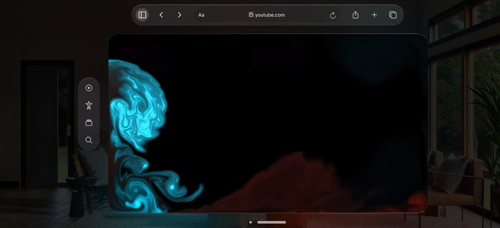

<h1 align="center"> 
Um Player de VR
</h1>

Desenvolvimento de uma versão web de uma experiência de player de vídeo em realidade virtual.

  

 

  

 

## 🚀 Tecnologias

Esse projeto foi desenvolvido com as seguintes tecnologias:

- HTML e CSS
- Ion Icons
- Akar Icons
- Figma
- Javascript

 

## 🔖 Layout

Você pode visualizar o layout do projeto através [DESSE LINK](https://www.figma.com/community/file/1253345035290143826). É necessário ter conta no [Figma](https://figma.com) para acessá-lo.

 

## 📝 License

Esse projeto está sob a licença MIT.

---

Feito por Ciro Batista da Silva
